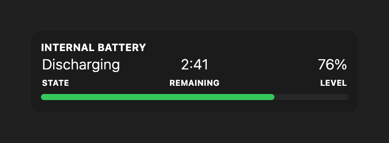

# Internal Battery Status

An internal battery widget for [Übersicht](http://tracesof.net/uebersicht/). It shows your Mac's built-in battery: charge state (charging, discharging, charged), current level, and estimated time remaining, with a charge bar. Colors are theme-aware, with sensible built-in defaults, so the widget works on its own.

## Screenshot

## Installation

- Download the [repository](https://github.com/dionmunk/uebersicht-internal-battery-status/archive/master.zip) and extract it.
- Place the `internal-battery-status.widget` folder in your Übersicht extension folder.
- Refresh Übersicht.

## License

This work is licensed under a [Creative Commons Attribution-NonCommercial 4.0 International License](https://creativecommons.org/licenses/by-nc/4.0/).
